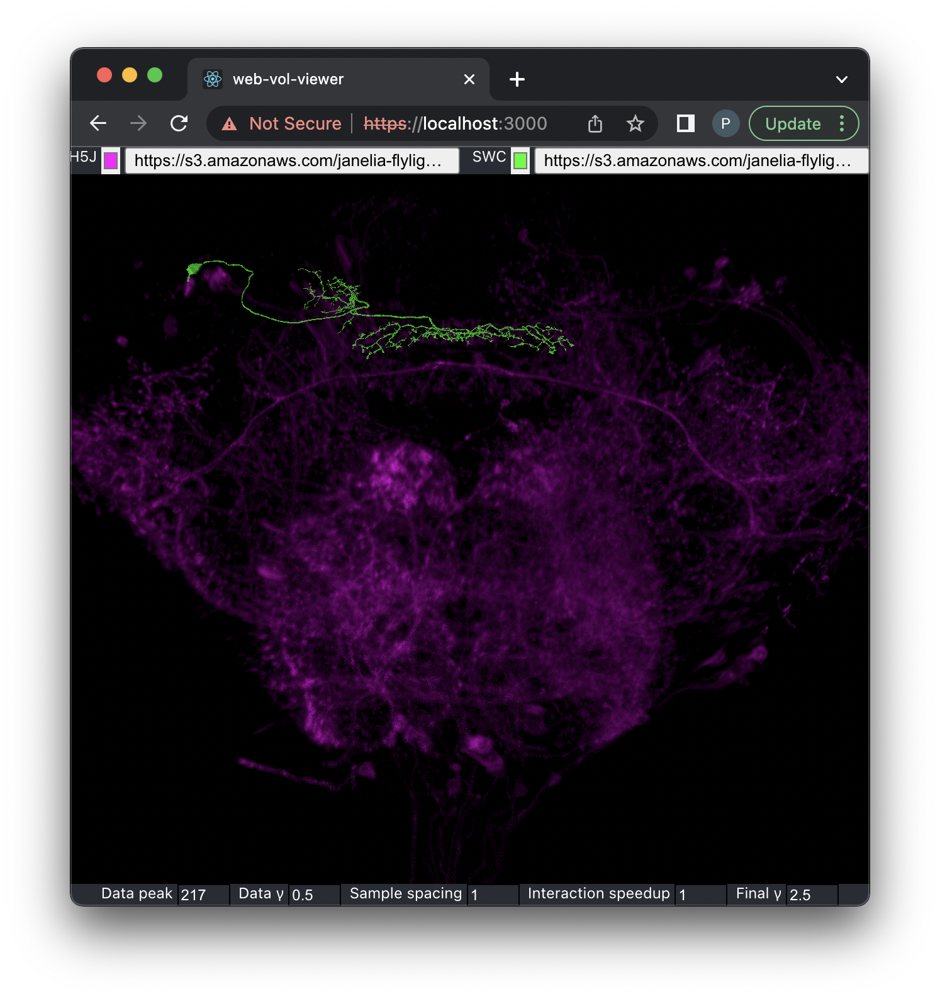
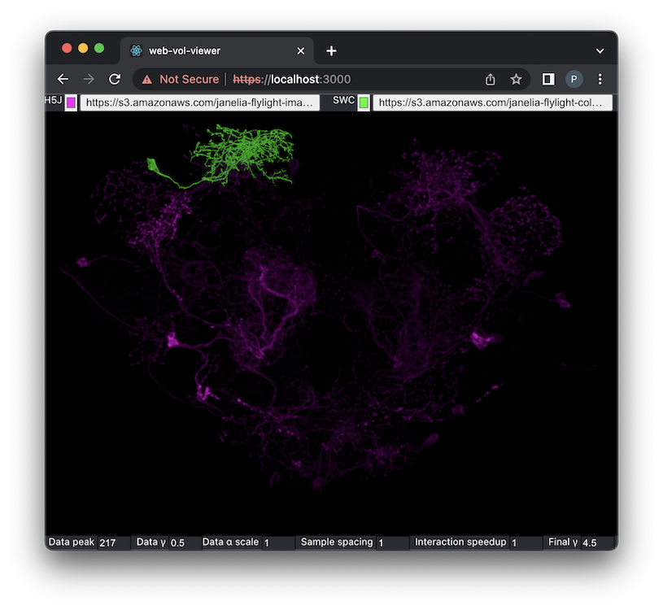
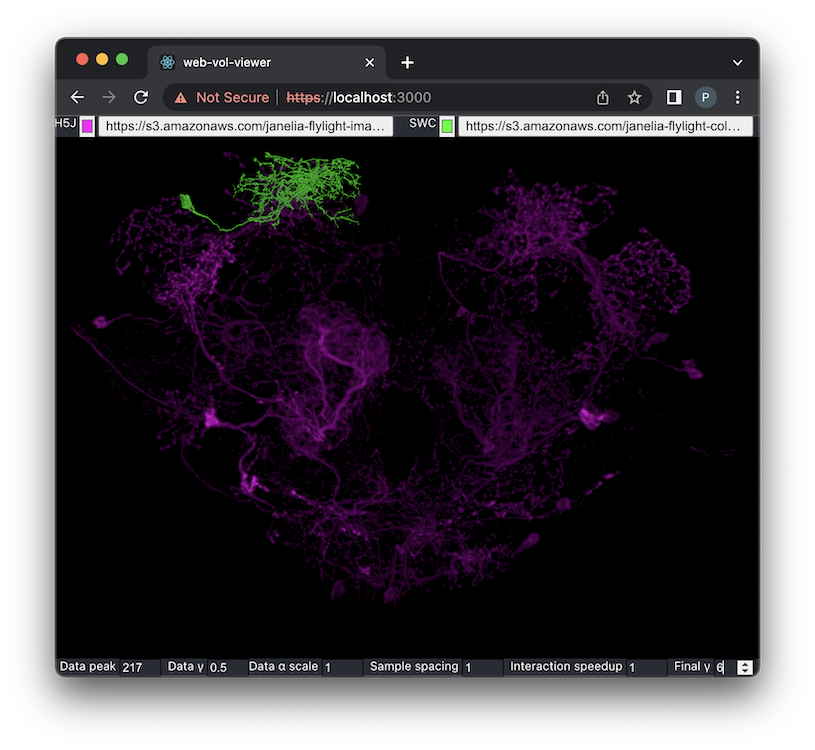

# web-vol-viewer

## Summary

This module implements a [React component](https://reactjs.org) for [direct volume rendering](https://en.wikipedia.org/wiki/Volume_rendering#Direct_volume_rendering) in a web browser using the [Three.js](https://threejs.org/) wrapper for [WebGL 2](https://www.khronos.org/webgl).  Its basic arguments are a 3D data volume in a JavaScript [`Uint8Array`](https://developer.mozilla.org/en-US/docs/Web/JavaScript/Reference/Global_Objects/Uint8Array), and a transfer function (to map data values to colors and opacities) in a Three.js [`DataTexture`](https://threejs.org/docs/#api/en/textures/DataTexture).  An additional, optional argument is a 3D surface in a Three.js [`Mesh`](https://threejs.org/docs/#api/en/objects/Mesh), which is rendered opaquely within the volume with proper depth occlusion.  The intended application is the matching of fluorescence light microscopy or "LM" data (the volume) with electron microscopy or "EM" data (the surface) in the 
[NeuronBridge](https://github.com/JaneliaSciComp/neuronbridge) system, but the renderer should be able to handle other applications.

An example of the EM-LM matching application is the following image, using data from the [FlyLight Generation 1 MCFO collection](https://gen1mcfo.janelia.org/cgi-bin/gen1mcfo.cgi) (citation: https://dx.doi.org/10.1016/j.celrep.2012.09.011). The magenta [LM volume for sample R89H10](https://s3.amazonaws.com/janelia-flylight-imagery/Gen1+MCFO/R89H10/R89H10-20190416_63_A4-m-40x-central-GAL4-JRC2018_Unisex_20x_HR-aligned_stack.h5j) is converted from [H5J format](https://github.com/JaneliaSciComp/workstation/blob/master/docs/H5JFileFormat.md) and the green [EM data for body 358259842](https://s3.amazonaws.com/janelia-flylight-color-depth/SWC/FlyEM_Hemibrain_v1.2.1/358259842.swc) is converted from [SWC format](http://www.neuronland.org/NLMorphologyConverter/MorphologyFormats/SWC/Spec.html).

<p align="center">

</p>

The implementation uses ray casting in a [GLSL](https://www.khronos.org/opengl/wiki/OpenGL_Shading_Language) fragment shader.  The basic idea was described as early as 2009 in a blog post by [Kyle Hayward](http://graphicsrunner.blogspot.com/2009/01/volume-rendering-101.html).  In 2014, [Leandro Barbagallo](http://www.lebarba.com) demonstrated a WebGL 1 version.  The implementation here is more closely related to a simpler approach from a blog post by [Will Usher](https://www.willusher.io/webgl/2019/01/13/volume-rendering-with-webgl) in 2019.  This code extends that approach in various ways, adding support for non-cubical volumes, lighting using gradients in the volume as the surface normal, and the opaque surface with depth occlusion.

## Usage

### Stand-Alone Application

The simplest way to use this renderer is as part of a stand-alone application, launched as follows:
```
npm start
```
The application will then be available in a web browser as `https://localhost:3000`.  It has the simple user interface shown in the images above:
* a button at the top for choosing the volume file, in [H5J format](https://github.com/JaneliaSciComp/workstation/blob/master/docs/H5JFileFormat.md); pressing this button reveals a panel for either entering a URL or choosing a local file on the host
* a button at the top for choosing the color of the rendered volume
* a button at the top for choosing the surface file, in [SWC format](http://www.neuronland.org/NLMorphologyConverter/MorphologyFormats/SWC/Spec.html) or [OBJ format](https://en.wikipedia.org/wiki/Wavefront_.obj_file), from either a URL or a local file as with the volume
* a button at the top for choosing the color of the rendered surface
* a control at the bottom for choosing the "data peak", the 8-bit value below which opacity ($\alpha$) falls off as controlled by the "data $\gamma$" (gamma); see [section on transfer functions](#transfer-functions)
* a control at the bottom for choosing the "data $\gamma$", which controls the rate of opacity ($\alpha$) falloff from the "data peak"; see [section on transfer functions](#transfer-functions)
* a control at the bottom for choosing the "data $\alpha$ scale", which adjusts the opacity ($\alpha$) at each sample in the ray casting
* a control at the bottom for choosing the spacing of samples in the ray casting, with a value larger than the default of 1 improving performance at the cost of quality
* a control at the bottom for choosing the speedup (resolution reduction) during camera interaction, with a value larger than the default of 1 improving performance at the cost of quality
* a control at the bottom for choosing the "final $\gamma$", which helps to bring out faint features in the data; see [section on transfer functions](#transfer-functions)
* mouse and key bindings for camera orbiting, zooming and panning, from the [three-orbit-unlimited-controls](https://github.com/JaneliaSciComp/three-orbit-unlimited-controls) module
* a `spacebar` key binding to toggle the surface off and on
* an `l` key binding to toggle lighting off and on
* an `m` key binding to toggle mirroring of the volume data along the _x_ dimension

The user interface is implemented with only standard HTML and CSS to avoid package dependencies.

### Reusable Component with User Interface

The `H5j3dViewerWithBasicUI` component makes the renderer and simple user interface available for use in other applications.  If the other application is a React functional component, the code would be like the following:
```javascript
import { H5j3dViewerWithBasicUI } from '@janelia/web-vol-viewer';

function App() {
  ...
  return (
    ...
    <H5j3dViewerWithBasicUI />
    ...
  );
);
```
The `H5j3dViewerWithBasicUI` component has no props because everything is set from its simple user interface.

If opening an H5J file with this component produces an error in the console, "SharedArrayBuffer is not defined", then the application may not have [cross-origin isolation](https://web.dev/cross-origin-isolation-guide) set up properly; see the [section on H5J volume data](#h5j-volume-data).

### Basic Reusable Component

Use the `Vol3dViewer` component to wrap the renderer in a different user interface, created with a toolkit like [Ant Design](https://ant.design) or [Material-UI](https://v4.mui.com/).  This component provides the renderer with no user interface beyond the mouse and key bindings (for camera control, etc.).  Here is an example of using it with its required props:

```jsx
import { Vol3dViewer } from '@janelia/web-vol-viewer';

function App() {
  ...
  return (
    ...
    <Vol3dViewer 
      volumeDataUint8={volumeDataUint8}
      volumeSize={volumeSize}
      voxelSize={voxelSize}
      transferFunctionTex={transferFunctionTex}
    />
    ...
  );
);
```

The required props are:
* `volumeDataUint8`: a JavaScript [`Uint8Array`](https://developer.mozilla.org/en-US/docs/Web/JavaScript/Reference/Global_Objects/Uint8Array) representing the data volume, with one 8-bit value per voxel
* `volumeSize`: an array, `[x, y, z]`, giving the volume size in voxels
* `voxelSize`: an array, `[x, y, z]`, giving the dimensions of each voxel in some consistent units (e.g, microns)
* `transferFunctionTex`: a Three.js [`DataTexture`](https://threejs.org/docs/#api/en/textures/DataTexture) with width 256, height 1, and pixel format `THREE.RGBAFormat`.  The texture's data is a `Uint8Array` of size 256 * 4 giving the color (with alpha) for each 8-bit data value.  See `src/TransferFunctions.js` for an example.

The component also supports additional optional props:

```jsx
import { Vol3dViewer } from '@janelia/web-vol-viewer';

function App() {
  ...
  return (
    ...
    <Vol3dViewer 
      volumeDataUint8={volumeDataUint8}
      volumeSize={volumeSize}
      voxelSize={voxelSize}
      transferFunctionTex={transferFunctionTex}

      useVolumeMirrorX={useVolumeMirrorX}
      alphaScale={alphaScale}
      dtScale={dtScale}
      interactionSpeedup={interactionSpeedup}
      finalGamma={finalGamma}
      cameraPosition={cameraPosition}
      cameraTarget={cameraTarget}
      cameraUp={cameraUp}
      cameraFovDegrees={cameraFovDegrees}
      orbitZoomSpeed={orbitZoomSpeed}
      useLighting={useLighting}
      useSurface={userSurface}
      surfaceMesh={surfaceMesh}
      surfaceColor={surfaceColor}
      onCameraChange={onCameraChange}
    />
    ...
  );
);
```

These optional props are:
* `useVolumeMirrorX` (default: false): controls whether to mirror the volume data along the _x_ axis
* `alphaScale` (default: 1): a lower value decreases the opacity ($\alpha$) at each sample when ray casting
* `dtScale` (default: 1): a higher value increases performance at the cost of quality, by increasing the step size when ray casting (and thus decreasing the number of samples)
* `interactionSpeedup` (default: 1): a higher value increases interactivity at the cost of quality, by reducing the rendering resolution during interactive camera manipulation; this setting should be needed only with weak graphics cards and large data sets
* `finalGamma` (default: 4.5): a higher value brings out more of that faint details in the rendering; see the [section on transfer functions](#transfer-functions)
* `cameraPosition` (default: `[0, 0, -2]`): the initial position of the camera, relative to the box representing the volume (which is centered at the origin, scaled so its longest dimension goes from -0.5 to 0.5)
* `cameraTarget` (default: `[0, 0, 0]`): the initial point at which the camera is looking
* `cameraUp` (default: `[0, -1, 0]`): the initial "up" direction for the camera
* `cameraFovDegrees` (default: 45.0): the vertical field of view of the camera, in degrees
* `orbitZoomSpeed` (default: 0.15): controls the speed with which the camera zooms on a mouse-wheel event
* `useLighting ` (default: `true`): controls whether the volume rendering uses lighting or not (in which case it is like a maximum intensity projection)
* `surfaceMesh` (default: `null`): a Three.js [`Mesh`](https://threejs.org/docs/#api/en/objects/Mesh) to be rendered within the volume
* `useSurface ` (default: `false`): controls whether the mesh is visible or not
* `surfaceColor` (default: `'#00ff00'`): the color of the mesh; note that there is no alpha because the mesh must be fully opaque
* `onCameraChange` (default: `null`): a function of the form `(event) => {}` called each time the camera changes position.  The `event.target` is the [`OrbitUnlimitedControls`](https://github.com/JaneliaSciComp/three-orbit-unlimited-controls) instance that controls the camera, and `event.target.object` is the Three.js [`PerspectiveCamera`](https://threejs.org/docs/#api/en/cameras/PerspectiveCamera).
* `onWebGLRender` (default: `null`): a function of the form `() => {}` called each time Three.js renders the 3D scene.  The `H5j3dViewerWithBasicUI` component uses this callback to implement throttling of the spinners on the UI controls.

If opening an H5J file with this component produces an error in the console, "SharedArrayBuffer is not defined", then the application may not have [cross-origin isolation](https://web.dev/cross-origin-isolation-guide) set up properly; see the [section on H5J volume data](#h5j-volume-data).

## Transfer Functions

The transfer function determines the color and opacity for every 8-bit data value in the volume.  It is implemented as a Three.js [`DataTexture`](https://threejs.org/docs/#api/en/textures/DataTexture) with width 256, height 1, and pixel format `THREE.RGBAFormat` meaning there is 4-byte RGBA value for each 8-bit data value.

This module implements a transfer function that works well for fluorescence microscopy data, as described in the publication: Wan et al., "FluoRender: An Application of 2D Image Space Methods for 3D and 4D Confocal Microscopy Data Visualization in Neurobiology Research", Proceedings of the 2012 IEEE Pacific Visualization Symposium, pp. 201–208 (https://www.ncbi.nlm.nih.gov/pmc/articles/PMC3622106).  The desktop application [VVD Viewer](https://github.com/takashi310/VVD_Viewer) also uses this transfer function.

The texture for this transfer function is returned by the following function from `src/TransferFunctions.js`:
```javascript
makeFluoTransferTex(alpha0, peak, dataGamma, alpha1, colorStr)
```
The basic color for all data values is `colorStr` (e.g., `'#ff00ff` for the most saturated magenta).  The alpha (i.e., 0 for most transparent, 255 for most opaque) varies with the data value in a "tent" shape.  Alpha rises from the `alpha0` value at the lowest data value (0) up to the alpha value 255 at the `peak` data value, then falls back to the `alpha1` value at the highest data value (255).  (It is typical for `alpha0` to be 0 and `alpha1` to be 255 so the value may not really "fall" after `peak`.)  The shape of the rise and fall is controlled by the `dataGamma` applied with a power function: `y ** (1.0 / dataGamma)`, where `y` is the data value normalized to be between 0 and 1.  A `dataGamma` of 1 would cause a linear rise and fall, but it is typical to use a `dataGamma` less than 1 (e.g., 0.5) to de-emphasize but not completely eliminate low data values.

After the transfer function is applied to colors that are accumulated during ray casting, a `finalGamma` is applied to the accumulated color: `c ** (1.0 / finalGamma)` (see the `pow()` call at the end of `fragmentShaderVolume` in `src/Shaders.js`, and note again that the color must be normalized to have components between 0 and 1).  It may seem counterintuitive to reduce the visibility of low data values with the `dataGamma` only to increase their visibility with the `finalGamma`, but this approach works well for fluorescence microscopy, where significant features emit more light and have higher data values.  The `dataGamma` prevents low data values from overwhelming small, significant features during the ray casting, while the `finalGamma` prevents the loss of areas with _only_ low data values, which can be important for visual context.

This effect is visible in the following two images, of sample [VT049371](https://s3.amazonaws.com/janelia-flylight-imagery/Gen1+MCFO/VT049371/VT049371-20171013_61_B1-f-40x-central-GAL4-JRC2018_Unisex_20x_HR-aligned_stack.h5j) and body [5901203987](https://s3.amazonaws.com/janelia-flylight-color-depth/SWC/FlyEM_Hemibrain_v1.2.1/5901203987.swc) from the [FlyLight Generation 1 MCFO collection](https://gen1mcfo.janelia.org/cgi-bin/gen1mcfo.cgi) (citation: https://dx.doi.org/10.1016/j.celrep.2012.09.011).  With the default `finalGamma` of 4.5, not much of the low-value context is visible:
<div>
<p align="center">

</p>
<div>

Increasing the `finalGamma` to 6 reveals more context without overwhelming the significant features visible in the previous image:
<div>
<p align="center">

</p>
<div>

The renderer can work with other transfer functions but the module does not implement any at this time.

## H5J Volume Data

The renderer in this module should work with a variety of data representable in a `Uint8Array`, but the support code has been designed specifically to work with volumes in the [H5J format](https://github.com/JaneliaSciComp/workstation/blob/master/docs/H5JFileFormat.md).  A H5J file is an [HDF5 container](https://www.hdfgroup.org/solutions/hdf5/) with one or more channels of 3D volumetric data with 12-bit values compressed using [H.265 (a.k.a. HEVC or High Efficiency Video Coding)](https://en.wikipedia.org/wiki/High_Efficiency_Video_Coding).  H5J is a "visually lossless" format useful for fluorescence microscopy data.

H5J data is loaded into a `Uint8Array` using the [`web-h5j-loader` module](https://github.com/JaneliaSciComp/web-h5j-loader).  This module includes several example data sets for testing: one includes a sphere, cones and a cylinder, while another is actual microscopy data from the [FlyLight Generation 1 MCFO collection](https://gen1mcfo.janelia.org/cgi-bin/gen1mcfo.cgi).

The `web-h5j-loader` module uses multi-threaded [WebAssembly (wasm)](https://webassembly.org) code from the [`ffmpeg.wasm` module](https://github.com/ffmpegwasm/ffmpeg.wasm).  The threads depends on a [`SharedArrayBuffer`](https://developer.mozilla.org/en-US/docs/Web/JavaScript/Reference/Global_Objects/SharedArrayBuffer) to implement shared memory.  Due to [security risks](https://developer.mozilla.org/en-US/docs/Web/JavaScript/Reference/Global_Objects/SharedArrayBuffer#security_requirements), `SharedArrayBuffer` is disabled in most browsers unless it is used with [cross-origin isolation](https://web.dev/cross-origin-isolation-guide).  If the server is not cross-origin isolated, loading an H5J file will produce an exception:
```
SharedArrayBuffer is not defined
```

To enable cross-origin isolation, a site must be served with two additional headers:
```
Cross-Origin-Opener-Policy: same-origin
Cross-Origin-Embedder-Policy: require-corp
```
For a site created with [`create-react-app`](https://create-react-app.dev/), a way to add these headers to the development server is to use the [CRACO (Create React App Configuration Override) package](https://github.com/gsoft-inc/craco).  The stand-alone application included in this module is set up to use CRACO, and the approach can be copied in another application using one of the components from this module:
1. Install CRACO:
    ```
    npm install @craco/craco --save
    ```
    (With newer versions of NPM, it may be necessary to append the [` --legacy-peer-deps` argument](https://stackoverflow.com/questions/66239691/what-does-npm-install-legacy-peer-deps-do-exactly-when-is-it-recommended-wh) to the end of the previous installation line.)
2. Copy this module's `craco.config.js` file (as a sibling to the site's `package.json` file), which adds the two additional headers.
3. Change the `react-scripts` to `craco` in most entries of the `scripts` section of the other application's `package.json` file:
    ```
    ...
    "scripts": {
      "start": "craco start",
      "build": "craco build",
      "test": "craco test",
      "eject": "react-scripts eject"
    },
    ...
    ```

## Tips

Performance can be poor in the Chrome browser if the Developer Tools panel is open, for some reason.  Closing that panel significantly improves performance.

